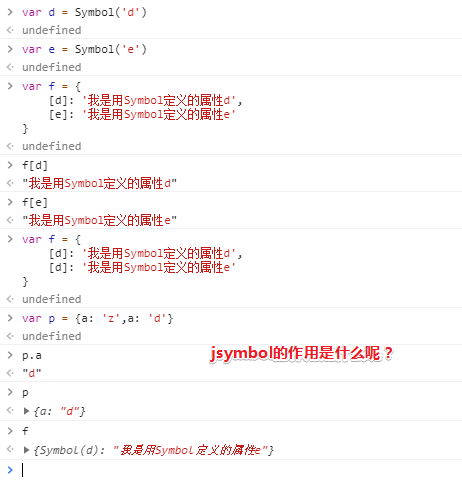

# ES基础知识点

> JavaScript 是 ECMAScript 规范的一种实现

## ★变量类型

### ◇JS的数据类型分类和判断

JavaScript 是一种弱类型脚本语言，所谓弱类型指的是定义变量时，不需要什么类型，在程序运行过程中会自动判断类型。

> 关于弱类型和动态类型的概述，**✎：**
>
> - 动态类型：在运行时确定变量类型（由于不用定义类型，写得快一些）
> - 弱类型：没有严格定义，偏向于容忍隐式类型转换

ECMAScript 中定义了 6 种原始类型：

- Boolean
- String
- Number
- Null
- Undefined
- Symbol（ES6 新定义）

> ES6 引入了一种新的原始数据类型`Symbol`，表示独一无二的值。Symbol 值通过`Symbol`函数生成。这就是说，对象的属性名现在可以有两种类型，一种是**原来就有的字符串**，另一种就是**新增的 Symbol 类型**。凡是属性名属于 Symbol 类型，就都是独一无二的，可以保证不会与其他属性名产生冲突。
>
> **➹：**[Symbol - ECMAScript 6入门](http://es6.ruanyifeng.com/#docs/symbol)
>
> **➹：**[「每日一题」JS 中的 Symbol 是什么？ - 知乎](https://zhuanlan.zhihu.com/p/22652486)
>
> **➹：**[javascript的Mixins - 简书](https://www.jianshu.com/p/90d2f802bc26)

**注意**：原始类型不包含 Object。

#### 类型判断用到哪些方法？

##### typeof

`typeof xxx`得到的值有以下几种类型：`undefined` `boolean` `number` `string` `object` `function`、`symbol` ，比较简单，不再一一演示了。这里需要注意的有三点：

- `typeof null`结果是`object` ，实际这是`typeof`的一个bug，null是原始值，非引用类型
- `typeof [1, 2]`结果是`object`，结果中没有`array`这一项，引用类型除了`function`其他的全部都是`object`
- `typeof Symbol()` 用`typeof`获取`symbol`类型的值得到的是`symbol`，这是 ES6 新增的知识点

**➹：**[typeof - MDN](https://developer.mozilla.org/zh-CN/docs/Web/JavaScript/Reference/Operators/typeof)

##### instanceof

用于实例和构造函数的对应。例如判断一个变量是否是数组，使用`typeof`无法判断，但可以使用`[1, 2] instanceof Array`来判断。因为，`[1, 2]`是数组，它的构造函数就是`Array`。同理：

```js
function Foo(name) {
    this.name = name
}
var foo = new Foo('bar')
console.log(foo instanceof Foo) // true
```

**➹：**[instanceof - MDN](https://developer.mozilla.org/zh-CN/docs/Web/JavaScript/Reference/Operators/instanceof)

> 总之，我们要做的是判断这个变量到底是什么类型，为此才能更好地进行下一步操作！
>
> 关于Symbol这个类型，没有接触过……不熟悉……
>
> 那么如何判断一个变量到底是不是null值呢？即为Null类型的变量……
>
> `Object.prototype.toString.call(null)  //"[object Null]"`
>
> **➹：**[所以为什么 JS 的 typeof 不需要括号 （如何判断数据类型） - 简书](https://www.jianshu.com/p/b9d0191e09f3)
>
> 我很好奇为啥没有加call的阉割版函数调用会是这样的结果？
>
> `Object.prototype.toString(null)  //"[object Object]"`
>
> 照理说call的第一个参数就是this的值呀！为啥在使用这个方法的时候需要用到call才能得到想要的结果呢？
>
> **➹：**[Object.prototype.toString() - MDN](https://developer.mozilla.org/zh-CN/docs/Web/JavaScript/Reference/Global_Objects/Object/toString)
>
> **➹：**[JavaScript:Object.prototype.toString方法的原理 - 紫云飞 - 博客园](http://www.cnblogs.com/ziyunfei/archive/2012/11/05/2754156.html)
>
> **➹：**[谈谈 Object.prototype.toString 。 - 掘金](https://juejin.im/post/591647550ce4630069df1c4a)

---

### ◇值类型和引用类型

#### 值类型和引用类型的区别？

除了原始类型，ES 还有引用类型，上文提到的`typeof`识别出来的类型中，只有`object`和`function`是引用类型，其他都是值类型。

根据 JavaScript 中的变量类型传递方式，又分为**值类型**和**引用类型**，值类型变量包括 Boolean、String、Number、Undefined、Null，引用类型包括了 Object 类的所有，如 Date、Array、Function 等。在参数传递方式上，值类型是按值传递，引用类型是按共享传递。

下面通过一个小题目，来看下两者的主要区别，以及实际开发中需要注意的地方。

```js
// 值类型
var a = 10
var b = a
b = 20
console.log(a)  // 10
console.log(b)  // 20
```

上述代码中，`a` `b`都是值类型，两者分别修改赋值，相互之间没有任何影响。再看引用类型的例子：

```js
// 引用类型
var a = {x: 10, y: 20}
var b = a
b.x = 100
b.y = 200
console.log(a)  // {x: 100, y: 200}
console.log(b)  // {x: 100, y: 200}
```

上述代码中，`a` `b`都是引用类型。在执行了`b = a`之后，修改`b`的属性值，`a`的也跟着变化。因为`a`和`b`都是引用类型，指向了同一个内存地址，即两者引用的是同一个值，因此`b`修改属性时，`a`的值随之改动。

再借助题目进一步讲解一下。

> 说出下面代码的执行结果，并分析其原因。

```js
function foo(a){
    a = a * 10;
}
function bar(b){
    b.value = 'new';
}
var a = 1;
var b = {value: 'old'};
foo(a);
bar(b);
console.log(a); // 1
console.log(b); // value: new
```

通过代码执行，会发现：

- `a`的值没有发生改变
- 而`b`的值发生了改变

这就是因为`Number`类型的`a`是按值传递的，而`Object`类型的`b`是按共享传递的。

JS 中这种设计的原因是：按值传递的类型，复制一份存入栈内存，这类类型一般不占用太多内存，而且按值传递保证了其访问速度。按共享传递的类型，是复制其引用，而不是整个复制其值（C 语言中的指针），保证过大的对象等不会因为不停复制内容而造成内存的浪费。

引用类型经常会在代码中按照下面的写法使用，或者说**容易不知不觉中造成错误**！

```js
var obj = {
    a: 1,
    b: [1,2,3]
}
var a = obj.a
var b = obj.b
a = 2
b.push(4)
console.log(obj, a, b)
```

虽然`obj`本身是个引用类型的变量（对象），但是内部的`a`和`b`一个是值类型一个是引用类型，`a`的赋值不会改变`obj.a`，但是`b`的操作却会反映到`obj`对象上。

#### self

> 关于对原始类型的叫法，就我目前所了解的就有简单类型、基本类型、值类型；而引用类型，则还有复杂类型的叫法！
>
> 为了统一叫法，我就叫原始类型和引用类型好了！注意，Symbol可不是引用类型
>
> 当我们把原始类型或者引用类型的值赋值给一个变量的时候，原始类型是按值传递，所以原始类型也被叫做值类型；而引用类型则是按共享传递，也就是说不同变量可以同时持有同一份内存地址，它们各自都能读写同一份内存空间……


## ★总结

## ★Q&A

### ①JavaScript概述？

> **JavaScript (** **JS** ) 是一种具有[函数优先](https://developer.mozilla.org/en-US/docs/Glossary/First-class_Function)（即函数是一等公民）的轻量级解释型或即时编译型的编程语言。

**➹：**[JavaScript - MDN](https://developer.mozilla.org/zh-CN/docs/Web/JavaScript)

**➹：**[JavaScript到底是解释型语言还是编译型语言? - 个人文章 - SegmentFault 思否](https://segmentfault.com/a/1190000013126460)

**➹：**[编程语言 标记语言 脚本语言分别有哪些？ 区别是什么？ - 知乎](https://www.zhihu.com/question/22443881)

**➹：**[弱类型、强类型、动态类型、静态类型语言的区别是什么？ - 知乎](https://www.zhihu.com/question/19918532)

**➹：**[即時編譯 - Wikiwand](https://www.wikiwand.com/zh/%E5%8D%B3%E6%99%82%E7%B7%A8%E8%AD%AF)

**➹：**[JavaScript 是什么？ - 知乎](https://www.zhihu.com/question/19813265)

###  ②为什么需要对变量进行类型判断？

我没有找到答案，我猜这是因为JavaScript是弱类型语言的缘故……毕竟隐式类型转换的规则甚是操蛋哈！它可以让你装逼，也可以让你的代码中毒……

```js
var class2type = {} ;
"Boolean Number String Function Array Date RegExp Object Error".split(" ").forEach(function(e,i){
    class2type[ "[object " + e + "]" ] = e.toLowerCase();
}) ;
//当然为了兼容IE低版本，forEach需要一个polyfill，不作细谈了。
function _typeof(obj){
    if ( obj == null ){
        return String( obj );
    }
    return typeof obj === "object" || typeof obj === "function" ?
        class2type[ class2type.toString.call(obj) ] || "object" :
        typeof obj;
}
```

**➹：**[javascript - 如何正确判断js数据类型 - SegmentFault 思否](https://segmentfault.com/q/1010000000464600)

**➹：**[鸭子类型 - Wikiwand](https://www.wikiwand.com/zh-hans/%E9%B8%AD%E5%AD%90%E7%B1%BB%E5%9E%8B)

**➹：**[你所忽略的js隐式转换 - 掘金](https://juejin.im/post/5a7172d9f265da3e3245cbca)

**➹：** 从`++[[]][+[]]+[+[]]==10`?深入浅出[弱类型JS的隐式转换](https://github.com/jawil/blog/issues/5)

### ③Symbol？



**➹：**[ES6学习之路～～Symbol：独一无二的值类型 - 我走过最长的路，就是这条爬坑之路！！！ - CSDN博客](https://blog.csdn.net/github_38847071/article/details/78275173)

**➹：**[「每日一题」JS 中的 Symbol 是什么？ - 知乎](https://zhuanlan.zhihu.com/p/22652486)